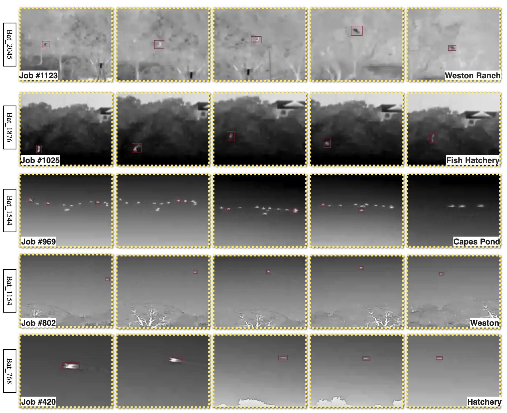
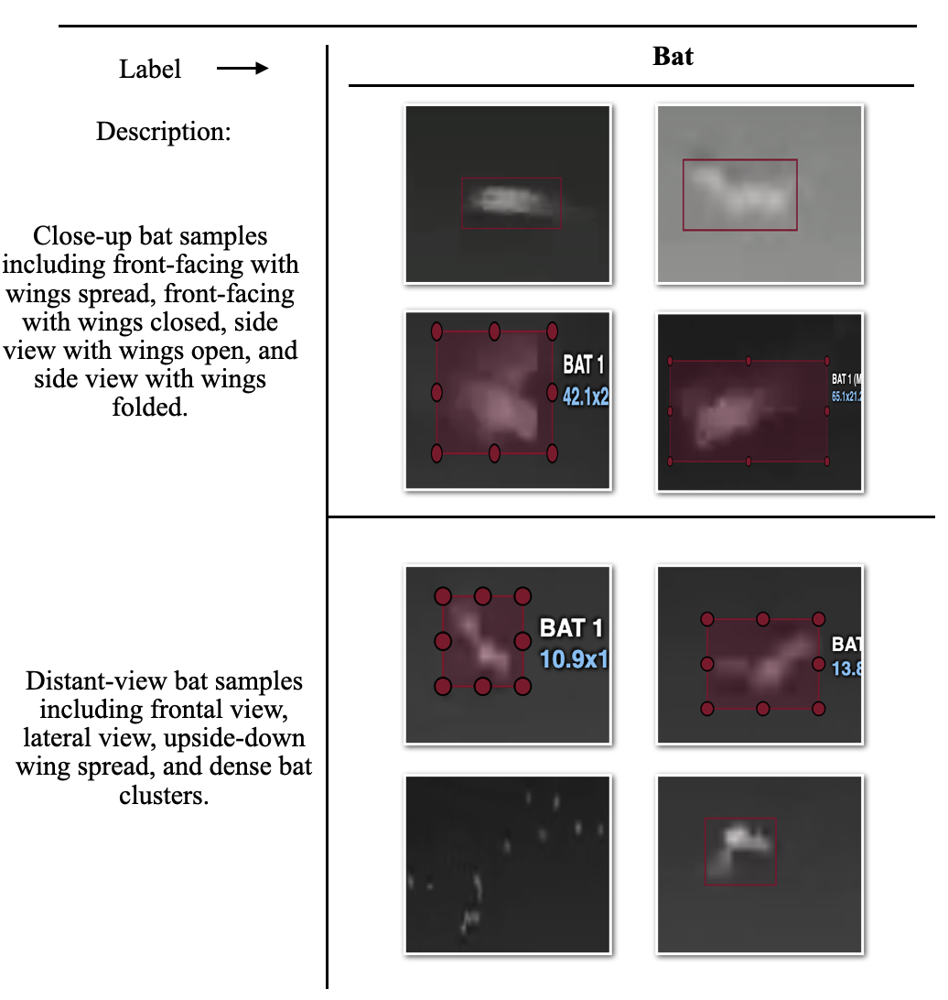
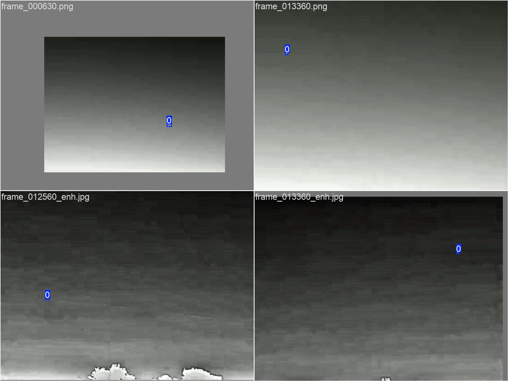
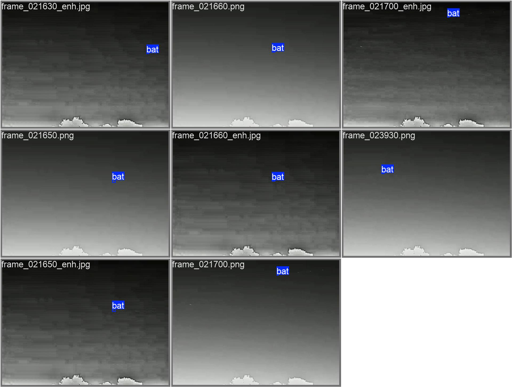
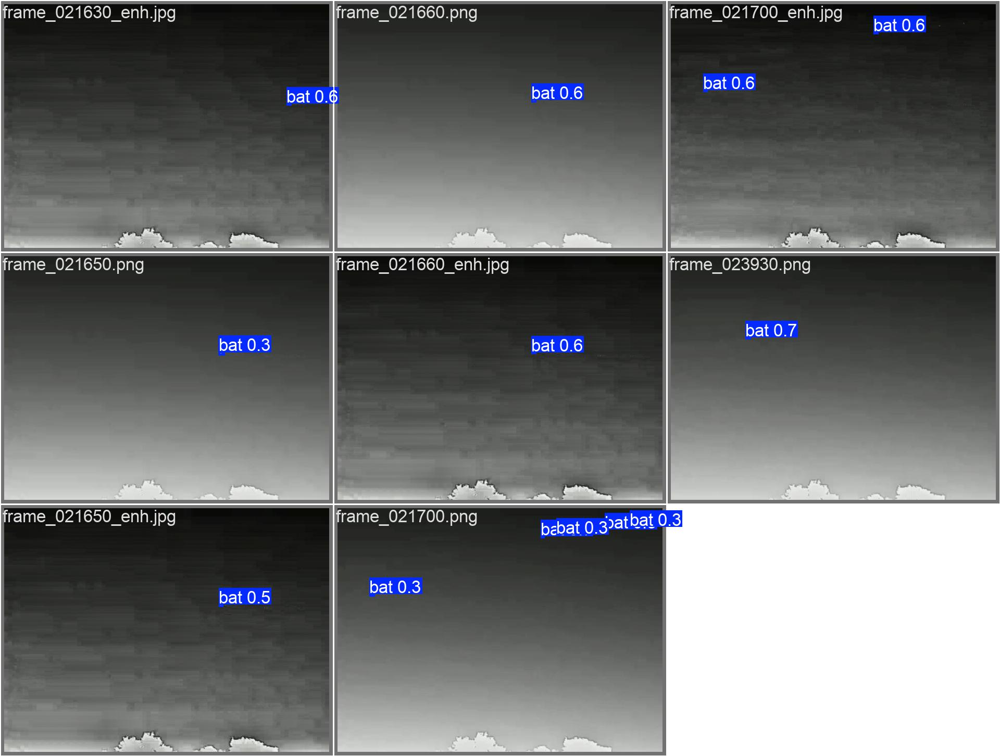

# 🦇 LoBat: An Open Low-Light Bat Video Dataset with MOG2-YOLO Baselines for Bat Identification

<p align="center">
  <a href="https://qoa10.github.io/">Wenhan Tao</a>, Carly Naundorff, Cerise Mensah, <a href="https://scholar.google.com/citations?hl=en&user=3m4U2zkAAAAJ">Mylene C. Q. Farias</a>, <a href="https://scholar.google.com/citations?hl=en&user=R0WFGeIAAAAJ">Sarah Fritts</a>, and <a href="https://scholar.google.com/citations?hl=en&user=jRLy9uoAAAAJ">Jelena Tešić</a>
</p>

<p align="center">
  Texas State University
</p>

<p align="center">
  <a href="https://drive.google.com/drive/folders/1Q2BjR5mpYaQoZ7F73QW6Xd7n1Y_hJ88c?dmr=1&ec=wgc-drive-hero-goto">Dataset</a> |
  <a href="#reproducibility">Reproducibility</a> |
  <a href="#citation">Citation</a>
</p>

LoBat is an open benchmark for low-light bat detection, providing annotated images, raw videos, and reproducible MOG2+YOLO baselines for evaluation under challenging nighttime conditions.

## Overview

The benchmark contains:

* Open bat detection dataset with **annotated images in YOLO format**
* **Raw videos** collected under challenging low-light conditions
* **Baseline training and evaluation scripts** based on **MOG2 + YOLO** for reproducible experiments

## Dataset Highlights

| Item              | Value                           |
| ----------------- | ------------------------------- |
| Task              | Low-light bat detection         |
| Annotation format | YOLO bounding boxes             |
| Image splits      | Train 4990 / Val 286 / Test 143 |
| Raw videos        | 20                              |
| Baseline          | MOG2 + YOLOv8                   |
| Institution       | Texas State University          |

## Dataset Download

Dataset link:

[Google Drive Folder](https://drive.google.com/drive/folders/1Q2BjR5mpYaQoZ7F73QW6Xd7n1Y_hJ88c?dmr=1&ec=wgc-drive-hero-goto)

The Drive folder contains two zip files:

* **Bat Images.zip** — labeled images for **YOLO object detection**
* **Bat Videos.zip** — raw videos for benchmarking and future study

## Visual Examples

<figure>
  <p align="center">
    <a href="picture/bat_place.png">
      
    </a>
  </p>
  <figcaption>
    <b>Figure 1. Continuous-frame examples.</b>
    In many scenes, bats are difficult to recognize from a single frame because of small size, motion blur, and low contrast. Consecutive frames provide stronger evidence for detection. The location name shown in the bottom-right of each sub-image corresponds to the recording site.
  </figcaption>
</figure>

<br>

<figure>
  <p align="center">
    <a href="picture/shapebat.png">
      
    </a>
  </p>
  <figcaption>
    <b>Figure 2. Shape diversity examples.</b>
    Bat appearance varies substantially across viewpoints and flight poses, producing diverse shapes and aspect ratios. This variability motivates robust detection under orientation and scale changes.
  </figcaption>
</figure>

## Dataset Structure

After extracting `Bat Images.zip`, the dataset follows the standard YOLO layout:

```text
Bat Images/
  data.yaml
  images/
    train/
    val/
    test/
  labels/
    train/
    val/
    test/
```

### Split Information

* **train:** 4990
* **val:** 286
* **test:** 143

The training split is larger because it includes augmented images.

### data.yaml

* Required for YOLO training
* Update the dataset root path inside `data.yaml` according to your local machine
* Do not change the class label names or class order

### Augmented vs. Original Images

* **Original images:** filenames start with `frame...`
* **Augmented images:** filenames use prefixes such as `blurred_frame...` and `dark_frame...`

If only original data is needed, keep files starting with `frame...` and use the matching label files.

### Labels

* YOLO `.txt` bounding boxes are stored under `labels/`
* The dataset is for **object detection**, not segmentation
* Other formats such as COCO JSON can be generated externally if needed

## Raw Videos

After extracting `Bat Videos.zip`, the repository provides raw videos intended for benchmarking, testing trained models, or future labeling.

The dataset includes 20 raw videos for benchmarking, testing trained models, and future annotation expansion.

Suggested notes:

* Mostly visible-light recordings
* Filenames use **location + date** naming
* Suffixes such as `_1`, `_2`, and `_3` indicate multiple segments from the same session
* Includes one infrared video as an additional cross-sensor case

## Training and Validation Snapshots

<figure>
  <p align="center">
    <a href="picture/train_batch0.jpg">
      
    </a>
  </p>
  <figcaption>
    <b>Figure 3. Training batch visualization.</b>
    Example training batch sampled from the YOLO dataloader.
  </figcaption>
</figure>

<br>

<figure>
  <p align="center">
    <a href="picture/val_batch1_labels.jpg">
      
    </a>
  </p>
  <figcaption>
    <b>Figure 4. Validation batch with ground-truth labels.</b>
    Visualization of annotated bounding boxes on a validation batch.
  </figcaption>
</figure>

<br>

<figure>
  <p align="center">
    <a href="picture/val_batch1_pred.jpg">
      
    </a>
  </p>
  <figcaption>
    <b>Figure 5. Validation batch with model predictions.</b>
    YOLOv8 prediction results on the same validation batch for qualitative comparison.
  </figcaption>
</figure>

## Reproducibility

This repository includes baseline scripts for:

* **Video inference** with motion gating using **MOG2 + YOLOv8**
* **Image-set evaluation** with YOLO labels and IoU matching
* **Training** with YOLOv8 on the provided labeled dataset

### Environment

* **Python:** 3.9+
* **Recommended IDE:** VS Code or PyCharm

### Install Dependencies

```bash
pip install ultralytics opencv-python numpy pandas matplotlib torch
```

For GPU acceleration, install the CUDA-matching PyTorch build from the official PyTorch website.

### Important Setup Note

The scripts currently use absolute paths. Before running, update the following as needed:

* `video_path` / `img_dir` / `label_dir`
* `model_path`
* `save_dir`

## Baseline Scripts

### `finaldetect.py`

End-to-end **video detection + analysis** pipeline based on **MOG2 + YOLOv8**.

Main functions:

* Motion gating with MOG2 to reduce unnecessary inference
* Stride-based triggering for configurable frame skipping
* YOLOv8 inference on triggered frames
* Structured outputs including CSV summaries and analysis-ready metrics
* Plot generation for reporting and visualization

Recommended when the goal is **quantitative reporting with CSV, plots, and summary metrics**.

### `video_mog2+yolov8.py`

Lightweight **video inference** script for fast qualitative testing.

Main functions:

* MOG2-based motion-triggered inference
* Configurable frame stride
* Annotated output video generation
* Basic runtime statistics in `video_metrics.txt`

Recommended when the goal is **annotated video output and quick runtime inspection**.

### `yolov8m.py`

YOLOv8 **training script** for this dataset.

This script includes:

* A starter training template for `yolov8m.pt`
* A weight-initialized training variant using a previous `best.pt`
* Editable hyperparameters for epochs, image size, batch size, device, augmentation, and output management

Important notes:

* The script uses absolute paths and must be edited locally before use
* Loading `best.pt` with `resume=False` initializes weights but starts a fresh optimization run

### `test_mog2+yolov8m.py`

Image-set **evaluation** script for quantitative testing on the labeled test split.

Main functions:

* Loads images from `images/test` and ground-truth labels from `labels/test`
* Runs YOLOv8 prediction and matches predictions to ground truth using an IoU threshold
* Computes Precision, Recall, F1, and average inference time
* Saves annotated images and outputs `metrics.txt`

## Quick Start

```bash
python finaldetect.py
```

## Notes for Final README Cleanup

Before publishing the final version, verify and unify the following:

* spelling corrections such as **Reproducibility** and **evaluation**
* whether a **paper link** should be added near the top
* whether a separate **pipeline figure** should be added to better match benchmark-style repositories

## Citation

### ACM Reference Format

Wenhan Tao, Carly Naundorff, Cerise Mensah, Mylene C. Q. Farias, Sarah Fritts, and Jelena Tešić. 2026. An Open Low-Light Bat Video Dataset with MOG2-YOLO Baselines for Bat Identification. In Proceedings of ACM International Conference on Multimedia (ACM MM ’26). ACM, New York, NY, USA, 7 pages. [https://doi.org/10.1145/XXXXXXXX.XXXXXXX](https://doi.org/10.1145/XXXXXXXX.XXXXXXX)

```bibtex
@inproceedings{tao2026lobat,
  author    = {Wenhan Tao and Carly Naundorff and Cerise Mensah and Mylene C. Q. Farias and Sarah Fritts and Jelena Teši{\'c}},
  title     = {An Open Low-Light Bat Video Dataset with MOG2-YOLO Baselines for Bat Identification},
  booktitle = {Proceedings of ACM International Conference on Multimedia (ACM MM '26)},
  year      = {2026},
  publisher = {ACM},
  address   = {New York, NY, USA},
  pages     = {7},
  doi       = {10.1145/XXXXXXXX.XXXXXXX}
}
```

## Contact

If you have issues accessing the dataset or reproducing the baseline, please open a GitHub issue or contact the project maintainers.
