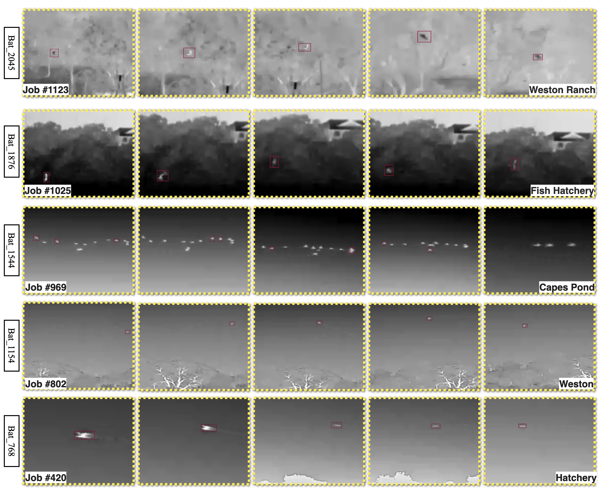
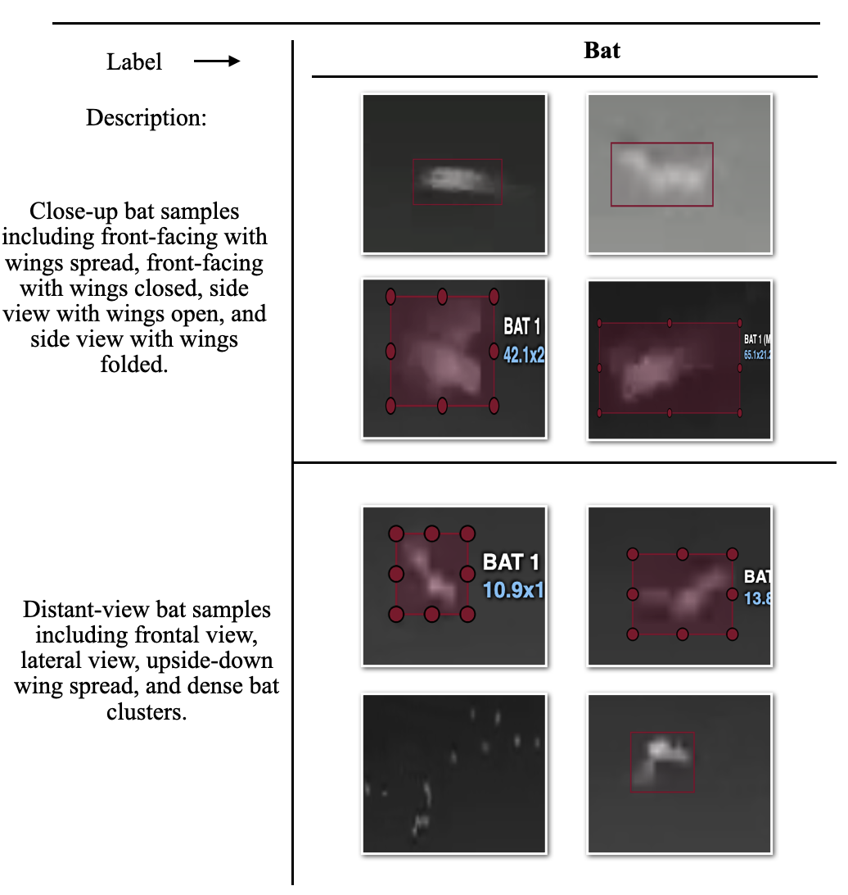
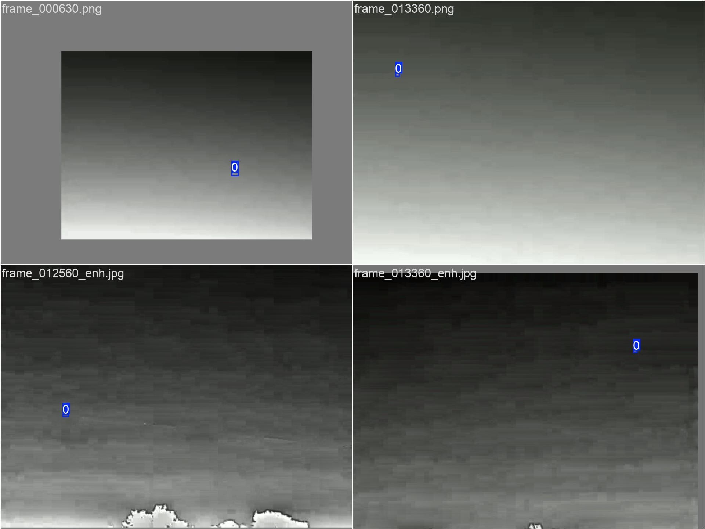
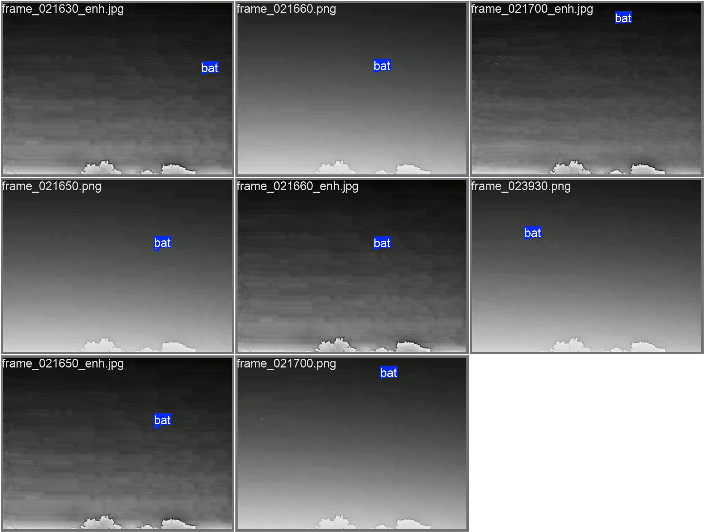
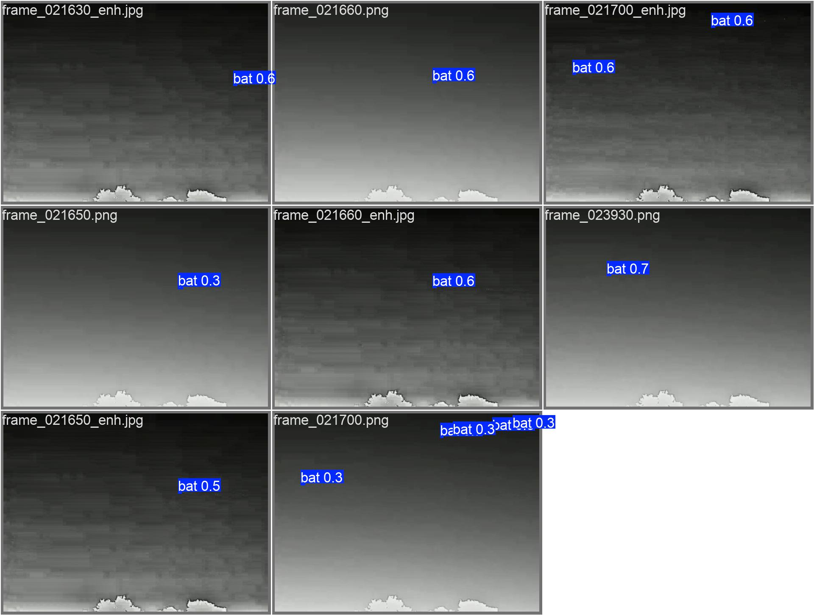

# 🦇 LoBat: Texas State Bat Video Dataset

<p align="center">
  <a href="https://qoa10.github.io/">Wenhan Tao</a>,
  Carly Naundorff,
  Cerise Mensah,
  <a href="https://scholar.google.com/citations?hl=en&user=3m4U2zkAAAAJ">Mylene C. Q. Farias</a>,
  <a href="https://scholar.google.com/citations?hl=en&user=R0WFGeIAAAAJ">Sarah Fritts</a>,
  and
  <a href="https://scholar.google.com/citations?hl=en&user=jRLy9uoAAAAJ">Jelena Tešić</a>
</p>

<p align="center">
  Texas State University
</p>

<p align="center">
  <a href="https://drive.google.com/drive/folders/1Q2BjR5mpYaQoZ7F73QW6Xd7n1Y_hJ88c?dmr=1&ec=wgc-drive-hero-goto">Dataset</a> |
  <a href="#reproducibility">Reproducibility</a> |
  <a href="#citation">Citation</a>
</p>

LoBat is an open long-duration long-wave infrared (LWIR) thermal video dataset and benchmark for automated bat detection under realistic nighttime outdoor conditions.

The dataset contains approximately **100 hours of continuous LWIR thermal video**, acquired during **20 nighttime recording sessions across seven open-field sites**. From more than **1 million systematically reviewed temporally sampled frames**, we construct a curated image-level benchmark of **1,427 annotated frames**, containing **1,380 bat bounding boxes** and **105 bird bounding boxes**.

The repository also provides YOLO-based detection baselines and motion-assisted video-processing scripts, including a MOG2--YOLO pipeline for reducing unnecessary detector inference in sparse long-duration video.

---

## Overview

The release provides:

* Approximately **100 hours of continuous LWIR thermal video**
* **20 nighttime recording sessions** collected across **seven open-field sites**
* A curated benchmark of **1,427 annotated frames**
* **1,380 bat bounding boxes**
* **105 bird bounding boxes** used as a secondary distractor class
* YOLO-format object-detection annotations
* Source-video-level train/validation/test partitions
* YOLO-based training and evaluation scripts
* Motion-assisted video inference using **MOG2 + YOLOv8**
* Dataset documentation and reproducibility resources

The benchmark focuses on **bat object detection** rather than species-level identification, individual identification, or re-identification.

---

## Dataset Highlights

| Item | Value |
| --- | --- |
| Task | Nighttime LWIR thermal bat detection |
| Sensor modality | Long-wave infrared (LWIR) thermal video |
| Raw video duration | Approximately 100 hours |
| Recording sessions | 20 |
| Recording sites | 7 |
| Annotated benchmark frames | 1,427 |
| Bat bounding boxes | 1,380 |
| Bird bounding boxes | 105 |
| Annotation format | YOLO bounding boxes |
| Official train split | 998 frames |
| Official validation split | 286 frames |
| Official test split | 143 frames |
| Baseline detector | YOLOv8 |
| Motion-assisted baseline | MOG2 + YOLOv8 |
| Institution | Texas State University |

The official benchmark is partitioned at the **source-video level** so that frames originating from the same continuous recording do not appear in multiple splits.

---

## Dataset Download

Dataset link:

[Google Drive Folder](https://drive.google.com/drive/folders/1Q2BjR5mpYaQoZ7F73QW6Xd7n1Y_hJ88c?dmr=1&ec=wgc-drive-hero-goto)

The Drive folder contains the released image benchmark and source videos.

Main archives include:

* **Bat Images.zip** — annotated benchmark images and YOLO-format labels
* **batvideo.zip** — continuous LWIR thermal source videos
* **best.pt** — trained YOLOv8 model weights used for the baseline experiments

---

## Visual Examples

<figure>
  <p align="center">
    <a href="picture/bat_place.png">
      
    </a>
  </p>
  <figcaption>
    <b>Figure 1. Representative temporal sequences.</b>
    Bats can appear as small, fast-moving targets with substantial changes in scale, pose, position, contrast, and visibility across neighboring thermal frames.
  </figcaption>
</figure>

<br>

<figure>
  <p align="center">
    <a href="picture/shapebat.png">
      
    </a>
  </p>
  <figcaption>
    <b>Figure 2. Representative bat appearance diversity.</b>
    Bat appearance varies substantially with target scale, viewpoint, pose, wing configuration, and imaging conditions.
  </figcaption>
</figure>

---

## Dataset Structure

After extracting `Bat Images.zip`, the dataset follows a standard YOLO object-detection layout:

```text
Bat Images/
  data.yaml
  images/
    train/
    val/
    test/
  labels/
    train/
    val/
    test/
````

### Official Benchmark Split

The official image-level benchmark contains:

* **Train:** 998 retained frames
* **Validation:** 286 retained frames
* **Test:** 143 retained frames

Total:

```text
998 + 286 + 143 = 1,427 frames
```

Partition assignment was performed at the **source-video level** to reduce temporal leakage between training, validation, and testing.

### Augmented Training Data

Some released training resources and baseline experiments use an augmented training set containing **4,990 images**.

These 4,990 images are augmented variants derived exclusively from the **998 manually labeled training images**. They should not be interpreted as 4,990 independent manually annotated benchmark frames.

For reporting results on the official benchmark, the original split remains:

```text
Train: 998
Validation: 286
Test: 143
```

### `data.yaml`

* Used for YOLO training and evaluation
* Update the dataset root path according to your local environment
* Do not change the class names or class order when reproducing the provided experiments

### Labels

* YOLO `.txt` bounding boxes are stored under `labels/`
* The benchmark is designed for **object detection**, not segmentation
* The primary target class is **bat**
* **Bird** is included as a secondary distractor class
* Other moving objects such as insects, vegetation, vehicles, and sensor artifacts are not assigned object labels

---

## Raw Videos

The release contains **20 continuous nighttime LWIR thermal source videos**, corresponding to **20 recording sessions across seven open-field sites**.

The recordings were acquired using a **Pulsar Accolade 2 LRF XP50 Pro LWIR thermal imaging system**.

Released videos have:

* Resolution: **640 × 480**
* Frame rate: **30 frames per second**
* Modality: **LWIR thermal**
* Format: grayscale MKV video
* Typical duration: approximately **5 hours per recording session**

Each source video corresponds to one continuous nighttime recording session. The source videos were not created by temporally concatenating separate recordings.

Repeated recordings at the same site may use different camera viewpoints.

The recordings were **not collected at operating wind turbines**, and no ultrasonic deterrent was operated during acquisition.

Exact geographic coordinates and other fine-grained location information are intentionally withheld to reduce the risk of revealing sensitive wildlife locations. Coarse site descriptors and recording dates are retained in the released metadata.

---

## Annotation Protocol

The source videos were systematically reviewed using CVAT.

Each source video was divided into three consecutive annotation-management segments of approximately equal duration. Videos were imported into CVAT using a frame step of 10.

At 30 frames per second, this corresponds to reviewing approximately one sampled frame every **0.33 seconds**.

A five-hour recording contains approximately:

```text
540,000 original frames
```

and approximately:

```text
54,000 temporally sampled frames
```

for manual inspection.

Across all 20 recordings, approximately **1.08 million sampled frames** were available for systematic review.

Annotators inspected sampled frames sequentially and could use neighboring frames to evaluate motion continuity, flight direction, and appearance.

Only confidently identified bat or bird instances were retained in the released image-level benchmark.

Highly repetitive neighboring detections from the same flight sequence were manually reduced to avoid excessive redundancy.

As a result, the released 1,427-frame benchmark is a **curated subset** of the systematically reviewed video frames rather than an exhaustive annotation of every bat occurrence in the source videos.

---

## Training and Validation Snapshots

<figure>
  <p align="center">
    <a href="picture/train_batch0.jpg">
      
    </a>
  </p>
  <figcaption>
    <b>Figure 3. Training batch visualization.</b>
    Example training batch sampled from the YOLO dataloader.
  </figcaption>
</figure>

<br>

<figure>
  <p align="center">
    <a href="picture/val_batch1_labels.jpg">
      
    </a>
  </p>
  <figcaption>
    <b>Figure 4. Validation batch with ground-truth labels.</b>
    Example annotated validation images with ground-truth bounding boxes.
  </figcaption>
</figure>

<br>

<figure>
  <p align="center">
    <a href="picture/val_batch1_pred.jpg">
      
    </a>
  </p>
  <figcaption>
    <b>Figure 5. Validation batch with model predictions.</b>
    Example YOLOv8 predictions on validation images.
  </figcaption>
</figure>

---

## Reproducibility

This repository includes baseline scripts for:

* YOLOv8 model training
* Image-level object-detection evaluation
* Full-frame video inference
* Motion-assisted frame selection using MOG2
* MOG2--YOLO video inference
* Runtime and detection-count analysis

### Environment

* **Python:** 3.9+
* CUDA-capable GPU recommended for YOLO inference and training

### Install Dependencies

```bash
pip install ultralytics opencv-python numpy pandas matplotlib torch
```

For GPU acceleration, install the PyTorch build compatible with your CUDA environment from the official PyTorch distribution.

### Important Setup Note

Some scripts use local paths that must be updated before execution.

Check and modify parameters such as:

* `video_path`
* `img_dir`
* `label_dir`
* `model_path`
* `save_dir`
* dataset paths in `data.yaml`

---

## Baseline Scripts

### `finaldetect.py`

End-to-end video detection and analysis pipeline based on **MOG2 + YOLOv8**.

Main functions include:

* Adaptive foreground estimation using MOG2
* Motion-based frame selection
* YOLOv8 inference on selected original frames
* Runtime measurement
* Detection-count analysis
* CSV output
* Plot generation

The MOG2 foreground mask is used only to determine whether the corresponding original thermal frame should be forwarded to YOLOv8. The mask itself is not supplied to the detector.

---

### `video_mog2+yolov8.py`

Lightweight video inference script for motion-assisted YOLOv8 evaluation.

Main functions include:

* MOG2-based motion detection
* Triggered YOLOv8 inference
* Annotated video output
* Basic runtime statistics

---

### `yolov8m.py`

YOLOv8 training script used for baseline model development.

The script supports configurable:

* Epochs
* Input resolution
* Batch size
* Device
* Data augmentation
* Output directories
* Weight initialization

Local paths must be updated before execution.

---

### `test_mog2+yolov8m.py`

Image-level evaluation script for the labeled benchmark.

Main functions include:

* Loading test images and YOLO labels
* YOLOv8 prediction
* IoU-based prediction-to-ground-truth matching
* Precision calculation
* Recall calculation
* F1-score calculation
* Inference-time measurement
* Annotated prediction output

---

## Baseline Results

The manuscript reports official image-level test results for the selected YOLOv8m detector.

| Class         | Precision | Recall |    F1 | AP@0.5 | AP@0.5:0.95 |
| ------------- | --------: | -----: | ----: | -----: | ----------: |
| Bat           |     0.890 |  0.985 | 0.935 |  0.981 |       0.720 |
| Bird          |     0.676 |  0.900 | 0.772 |  0.833 |       0.588 |
| Macro average |     0.783 |  0.943 | 0.854 |  0.907 |       0.654 |

For the motion-assisted video baseline, MOG2--YOLO reduced detector calls while retaining a substantial fraction of the detections produced by full-frame YOLO in the evaluated bat-containing clips.

These video-level results should be interpreted as reference baselines rather than exhaustive evaluation across all recording conditions.

---

## Quick Start

After updating the local paths:

```bash
python finaldetect.py
```

---

## Intended Use

The dataset is intended to support research on:

* Thermal small-object detection
* Automated bat monitoring
* Long-duration wildlife video analysis
* Sparse-event video processing
* Motion-assisted detector inference
* Temporal wildlife analysis
* Computationally efficient monitoring systems

The benchmark is not intended for species-level bat identification or individual re-identification.

---

## Known Limitations

Users should consider the following limitations:

* The image-level benchmark is curated rather than densely annotated across every frame of the source videos.
* Background-only frames are not included in the retained image-level benchmark.
* Synchronized meteorological measurements such as temperature, wind speed, humidity, and lunar illumination are not included.
* Exact geographic coordinates are withheld.
* Exact frame-index mappings between the sequentially numbered benchmark images and continuous source videos are not currently provided.
* Current video-level baseline evaluation covers a limited set of representative bat-containing and bat-absent clips.

---

## License

The released videos and annotations are provided under the:

**Creative Commons Attribution 4.0 International License (CC BY 4.0)**

The baseline source code is provided under the:

**MIT License**

Please acknowledge the dataset contributors when using these resources in research.

---

## Citation

A manuscript describing the dataset and baseline evaluation is currently being prepared for journal submission:

> Wenhan Tao, Carly Naundorff, Cerise Mensah, Mylene C. Q. Farias, Sarah Fritts, and Jelena Tešić.
> **Texas State Bat Video Dataset: A Long-Duration LWIR Benchmark for Bat Detection and Sparse-Event Video Processing.**
> 2026.

BibTeX:

```bibtex
@article{tao2026texasstatebat,
  author  = {Tao, Wenhan and Naundorff, Carly and Mensah, Cerise and Farias, Mylene C. Q. and Fritts, Sarah and Te\v{s}i\'{c}, Jelena},
  title   = {Texas State Bat Video Dataset: A Long-Duration LWIR Benchmark for Bat Detection and Sparse-Event Video Processing},
  year    = {2026},
  note    = {Manuscript}
}
```

The citation information will be updated after publication.

